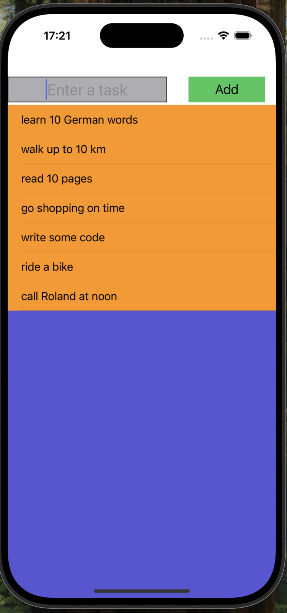

# ToDoApp - A Simple To-Do List Application

## Overview

ToDoApp is a simple To-Do list application where users can add, edit, and delete tasks. The app saves tasks using `UserDefaults`, ensuring tasks persist even after the app is closed. It provides a straightforward user interface where tasks are displayed in a table view, and the user can interact with the list easily.

## Features

- **Add a task**: Users can add new tasks or update existing ones.
- **Edit a task**: Selecting a task will allow the user to edit it.
- **Delete a task**: Tasks can be deleted by swiping to delete.
- **Persistence**: Tasks are saved to `UserDefaults` and are loaded when the app is launched.

## Technologies Used

- **UIKit**: Used for building the user interface.
- **UserDefaults**: Used for saving tasks locally to persist data.
- **UITableView**: Used for displaying the list of tasks.

## Code Explanation

### `ViewController.swift`

This file contains the main logic for handling tasks. The tasks are stored in an array of strings (`tasks`). The user can add, update, delete, and view tasks using the following features:

1. **Adding or Updating a Task**:
   - If the input field is empty, an alert is shown.
   - If a task is selected for editing, the task is updated. If no task is selected, a new task is added.

2. **Deleting a Task**:
   - Users can delete tasks by swiping left on a row and tapping the delete button.

3. **Persistence**:
   - The tasks are saved to and loaded from `UserDefaults`, ensuring that the tasks are preserved even after the app is closed.

4. **Table View**:
   - The tasks are displayed in a `UITableView`, with each task represented by a cell.
   - When a task is selected, it is loaded into the input field for editing.

## How to Use

1. **Add a Task**:
   - Type the task in the input field at the top and press the "Add" button.
   - The task will appear in the list below.

2. **Edit a Task**:
   - Tap on a task in the list. The task will appear in the input field, allowing you to edit it.
   - Press the "Add" button to save the changes.

3. **Delete a Task**:
   - Swipe left on a task in the list and tap the delete button.

## Setup Instructions

1. Clone this repository to your local machine.
2. Open the project in Xcode.
3. Build and run the app on the simulator or a physical device.

## License

This project is open-source and available under the MIT License.
